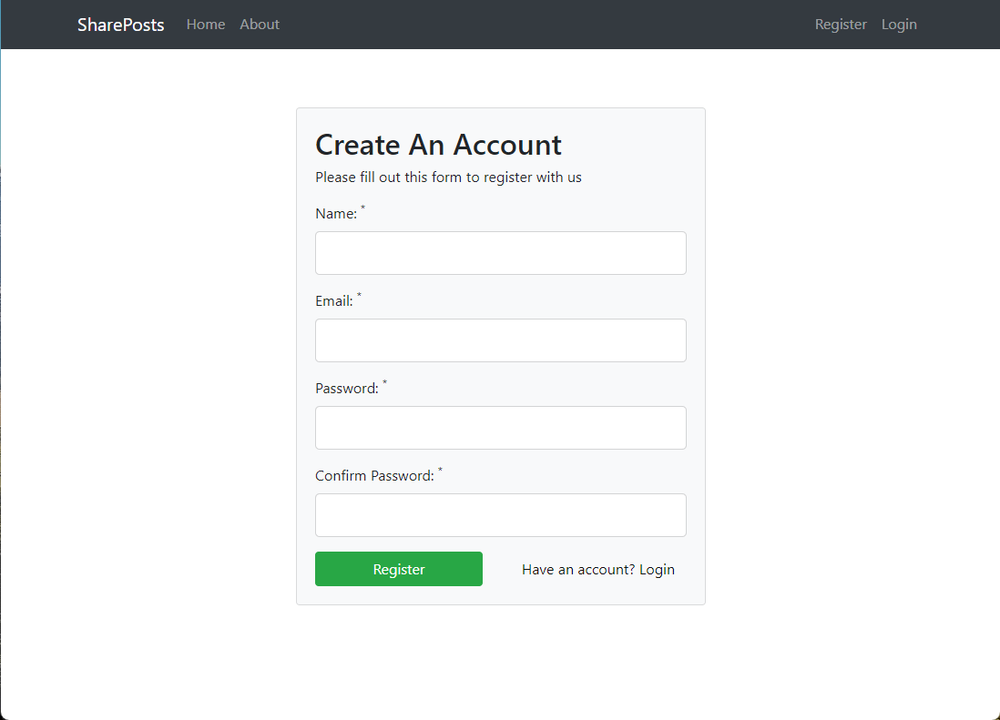

## SharePosts App

This project is a simple social network built on the PHP MVC framework. Users can register/login and create/edit/delete posts.

## Images

## Credits

This project was built following the tutorial by Brad Traversy on O'Reilly.(https://learning.oreilly.com/videos/object-oriented-php/9781789533149/)
